# cicd_learning

## CI/CD

**Continuous Integration (CI)**: It's a development practice where developers integrate code into a shared repository frequently, preferably several times a day. Each integration triggers automated builds and tests, ensuring early detection of integration errors.

For example, when pushing our code to GitHub with `git push`, we could automatically test our code and if it passes, merge the code. If it fails, do not merge and we would rewrite our code to pass the tests. The tests are done using the jenkins master node and agent nodes (ec2 instances)

- never work on main!!:
  - create a branch using git e.g. `git checkout dev`
  - make a change locally, push to github
  - if tests pass, trigger the next merge from dev to main
  - the merge should happen automatically if tests pass

**Continuous Deployment (CD)**: It's an extension of continuous integration where code changes are automatically deployed to production environments after passing through a series of automated tests, without human intervention.

Notably this is **deploying** the code:

### Deploy vs Deliver

Think of a movie. Before coming to cinemas, a trailer may be released a few weeks before release. The movie is ready, it just has not been released yet.
- This is equivalent to delivering code. 
- When the movie is released, this is equivalent to deploying the code. 

When the code is delivered, after pushing we can e.g. manually start the app

When the code is deployed, the app is automatically started when we push 

## CI/CD diagram

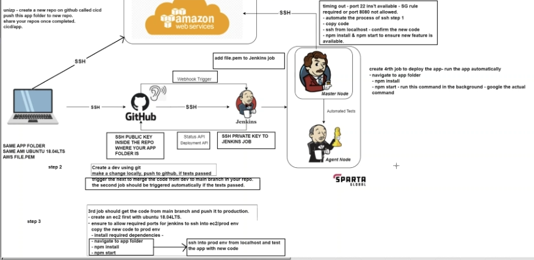

1. Start with a change to the code that we had already deployed (e.g. new login system) and upload it to GitHub
2. Use SSH to send the new code to Jenkins
3. Use Jenkins to perform automated tests
4. If the tests pass -> merge the changes to our code and send to cloud provider, ready to deoply
5. If the tests fail -> rewrite our code (go back to 1.)

## Webhooks

A webhook is a way to automatically trigger actions in one system when something happens in another system

For example, say you purchase something off Amazon. You then get an email for order confirmation, then later on an email saying your delivery has been dispatched. There is not a person manually sending these emails; it's automatic and is triggered from the initial purchase. So one action triggers a notification that triggers the next notification and so on...

This is implemented using (webhook) api calls

## CI/CD pipeline

**Why**: CI/CD pipelines automate the process of building, testing, and deploying code, which improves development efficiency, reduces errors, and accelerates time-to-market. 

**When**: CI/CD pipelines are beneficial for any project where there's frequent code changes and a need for quick and reliable deployment.

**Where**: CI/CD pipelines are commonly used in software development projects such as web applications and mobile apps

## Tutorial on automated testing with Jenkins and a webhook

Here is a detailed step by step walkthrough on how to create a jenkins job for automated testing and connecting it to GitHub using a webhook.

jenkins:

1. create job (named joshual-ci)
2. give description
3. tick 'GitHub project'
4. goto the app repo, click code and copy the https link and
paste https link in project url
1. tick 'restrict where this project can be run' and type sp, choose the option. there will be an error but just backspace and enter it again
2. for version control, select git and paste the ssh link to the repo (error will show)
3. click add key, select jenkins and give credentials, change kind to ssh username with private key, give username, and paste private key in

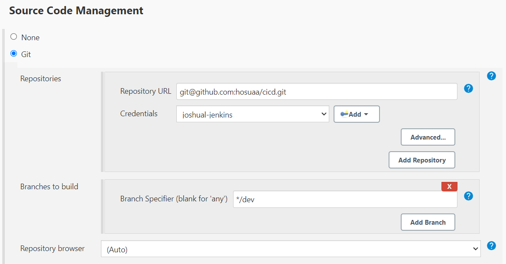

4. tick provide node & npm bin to PATH
5. build step: 
   1.  execute shell: 
   2.  commands:
   3.  cd app
   4.  npm install
   5.  npm test

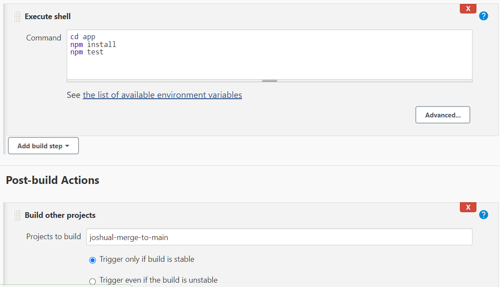

webhook:
1. goto app repo, settings, webhook and add webhook
2. call it http://3.9.14.9:8080/github-webhook/ (the link to jenkins plus the /github-webhook/
3. make it work on push requests
4. now onto jenkins, configure the project and tick github hook trigger

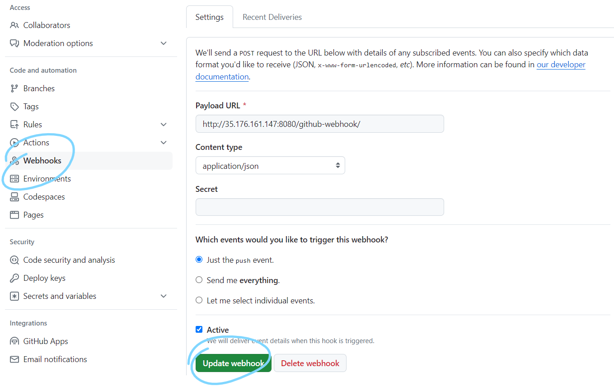

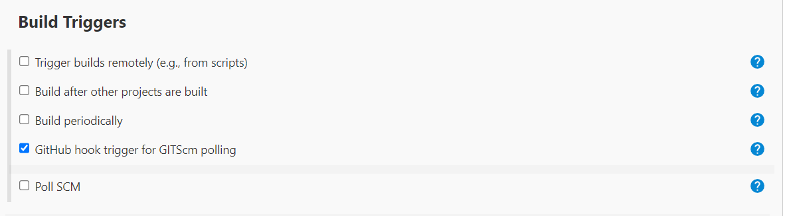

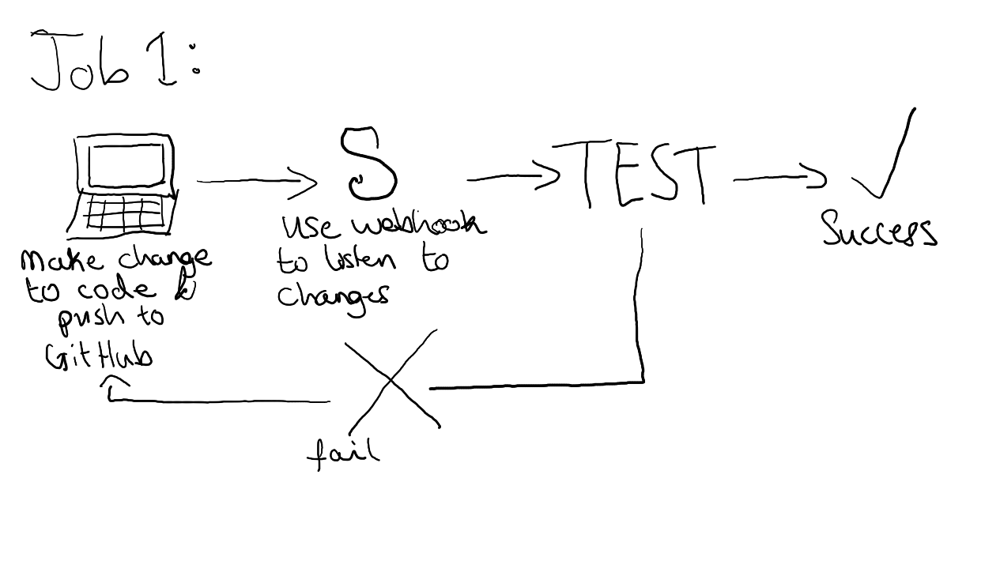

IMPORTANT: You don't want too many builds, or else the server can become overloaded and slow down/break. It's good to set a maximum number of builds for each job.

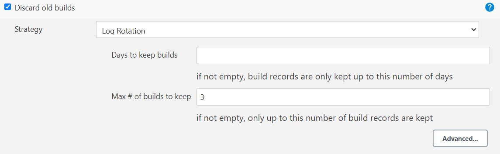

## CI Pipeline with Jenkins and GitHub

Never code on main branch: code on your teams branch or your own one.
- When you make changes, push them to GitHub. Then, with automated testing, if the tests pass merge your branch with main. 

Steps:
1. Create a dev branch using `git checkout`

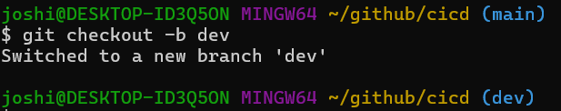

2. Make a change locally and push to GitHub
3. Using the testing job we created, if tests pass, trigger the next job to merge the code from your branch (`dev`) to `main`

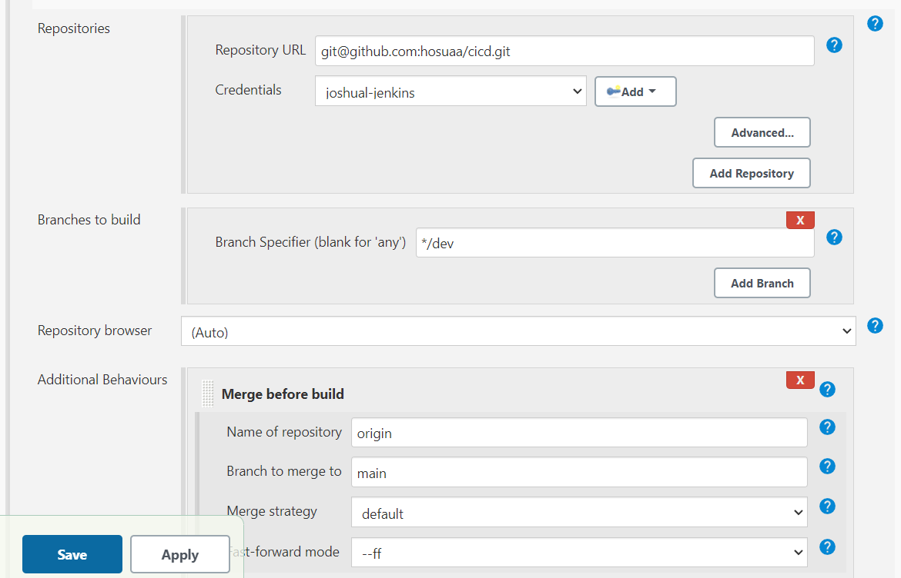

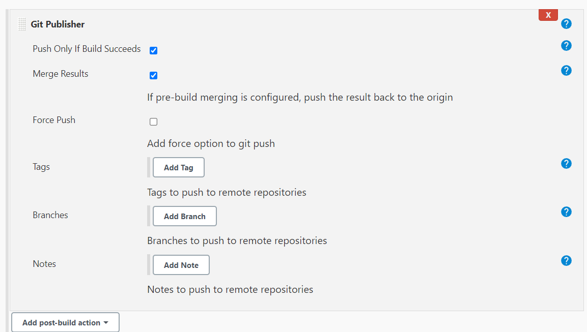

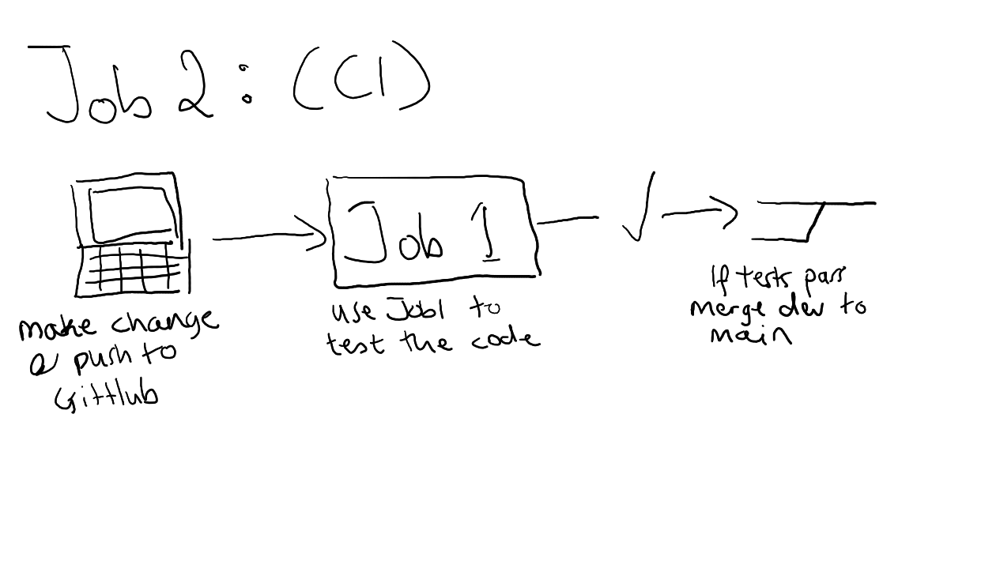


## Continuous delivery with Jenkins

Now our tested code is on main in GitHub, we need to copy our app code over to production (an EC2 instance)

Steps:
1. Create an EC2 instance (Ubuntu 18.04 LTS)
2. Network security groups: Allow SSH, 3000 (for node app) and 8080 (for Jenkins)
3. Copy app code to EC2 instance (`git clone`)
4. Install required dependancies (nodejs, )

Now we can SSH in to our EC2 instance and manually install and start the app

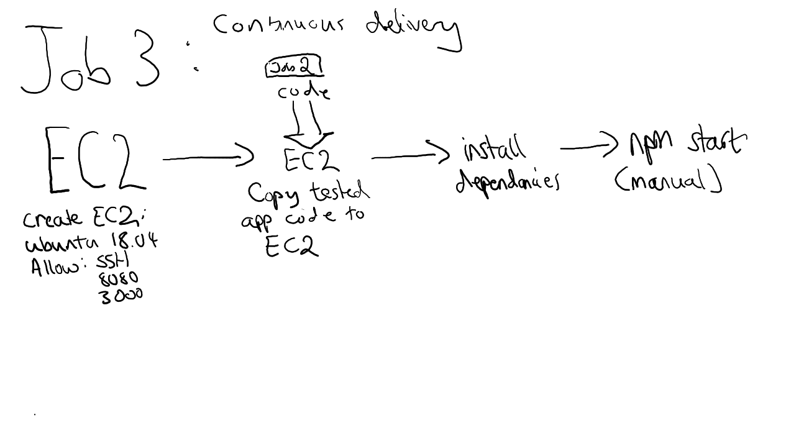

Remember get the code from main, as its tested

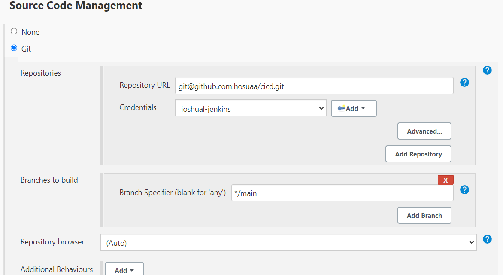

Also provide node to PATH and an SSH agent so you can SSH into the EC2 instance

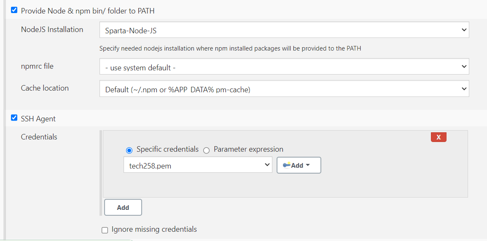

- Use `StrictHostKeyChecking=no` to avoid user input when SSHing in.
- `rsync` copies the files over 
- `provision.sh` contains most of the dependencies
- We can now manually SSH in. We have to also install `npm` and `pm2`
  - `sudo apt install npm`
  - `sudo npm install pm2@2.6.0 -g`
  - This could be ran in the script too
- Now simply cd to app, then `pm2 start app.js` to start the app in the background
  
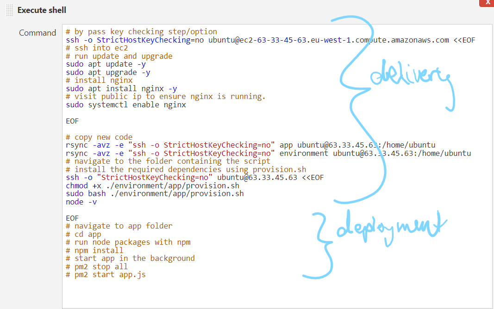

## Continuous deployment with Jenkins

We would like for our code to be automatically deployed (`run npm start`) when we push

Steps:
1. Use Jenkins to SSH into our EC2 without user input (`yes`)
   - To SSH in, we have to upload our private key for the EC2 instance to Jenkins
2. Goto app folder
3. Start the app in the background (if starting normally, Jenkins will crash)

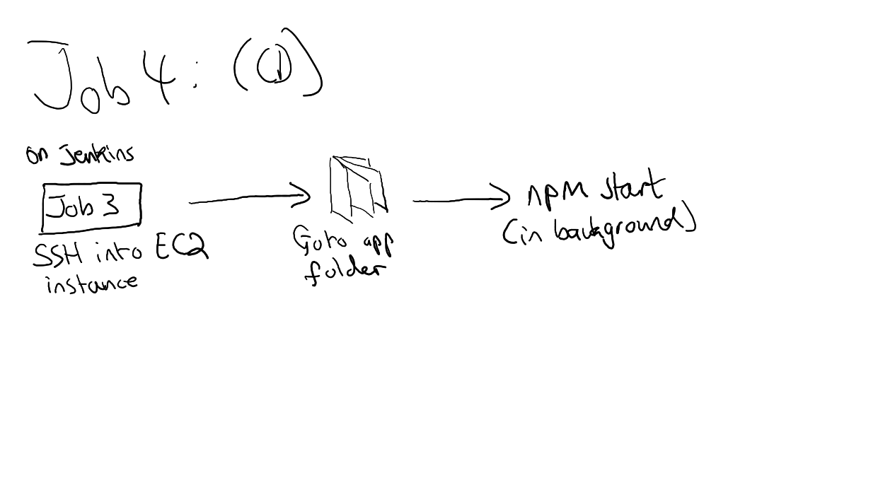

First, set up the job as a standalone job by copying the app code over (delivery) then deploying it (cd in, npm install, npm start)

The prerequisites are similar to the first other job

Make sure to run the process in the background, or else Jenkins will crash

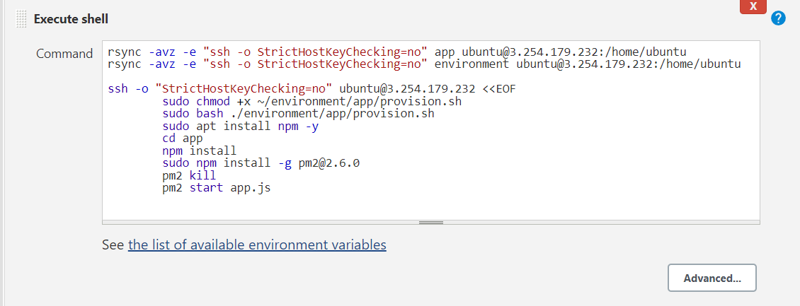

We can run these jobs one after the other to complete the CI/CD pipeline

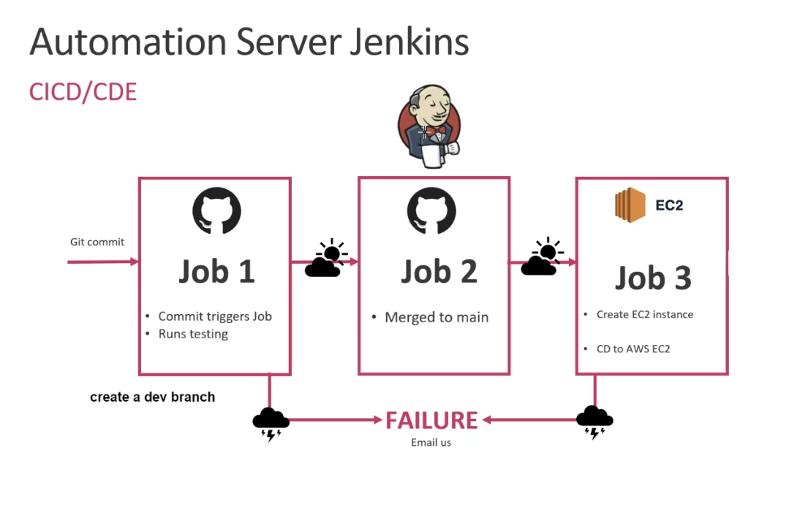

## Creating a Jenkins Server

1. Install Java (ensure before Jenkins)

```bash
sudo apt update
sudo apt install fontconfig openjdk-17-jre
java -version
openjdk version "17.0.8" 2023-07-18
OpenJDK Runtime Environment (build 17.0.8+7-Debian-1deb12u1)
OpenJDK 64-Bit Server VM (build 17.0.8+7-Debian-1deb12u1, mixed mode, sharing)
```

2. Install Jenkins on an EC2 instance with port 8080.

```bash
sudo wget -O /usr/share/keyrings/jenkins-keyring.asc \
  https://pkg.jenkins.io/debian-stable/jenkins.io-2023.key
echo "deb [signed-by=/usr/share/keyrings/jenkins-keyring.asc]" \
  https://pkg.jenkins.io/debian-stable binary/ | sudo tee \
  /etc/apt/sources.list.d/jenkins.list > /dev/null
sudo apt-get update
sudo apt-get install jenkins
```

3. Login with the default user. Connect to the public ip:8080:
   - Admin as the user
   - Password found in /var/lib/jenkins/secrets/initialAdminPassword

4. Install the necessary plugins:
   1. SSH agent
   2. Node
   3. Git Publisher

5. Create the jobs as normal

